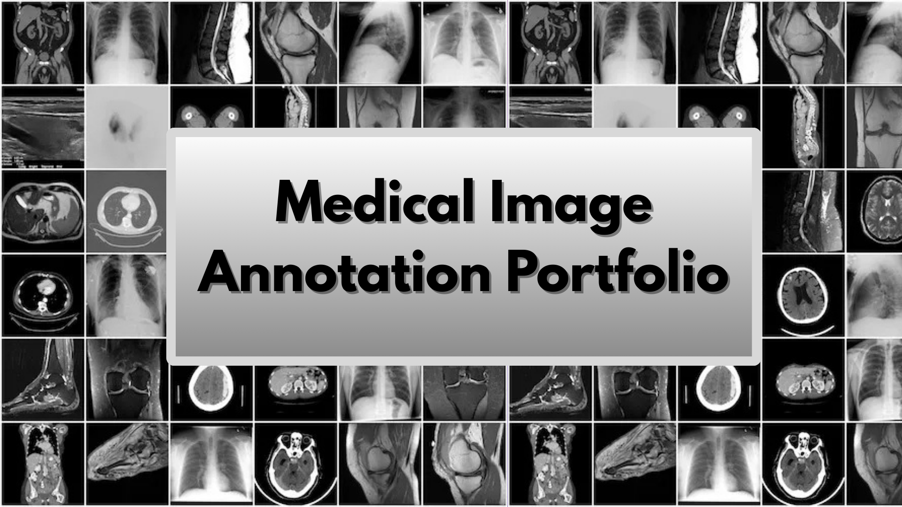

# 🩻 Medical Image Annotation Portfolio

Experienced **Radiology Technologist** with 16+ years in diagnostic imaging (X-ray, CT, MRI & Mammography).  
Hands-on practice in medical image annotation using **CVAT** on the **NIH Chest X-ray** dataset.

### Focus
- High-precision bounding boxes and polygons for pathologies and artifacts  
- Emphasis on clinical accuracy (anatomy, devices, quality control)  
- Transferable skills for AI training in radiology and healthcare informatics

**Dataset** • NIH Chest X-ray (public, educational use)  
**Tools** • CVAT (bounding boxes & polygons)  
**Annotations** • 15 images with pathologies, normal cases and common artifacts

### 📋 Pathologies & Artifacts Annotated
**Pathologies**
- Pneumonia 🩺
- Cardiomegaly ❤️
- Nodule 🔴
- Effusion 💧
- Atelectasis 🫁
- Consolidation 🟥
- Infiltration 🌫️
- Emphysema 🌀
- Fibrosis 🧵
- Mass 🟣

**Artifacts & Devices**
- Pacemaker (including leads) ⚡
- Central Venous Catheter (CVC) 🧪
- Sternal Wires 🔗
- Surgical Clips / Staples 📌
- Chemotherapy Catheter 💉
- Aortic Valve Prosthesis 🔩
- Humeral Plate 🦴

**Other**  
- No Finding (normal images) ✅

### 📸 Examples (click for full view)
  
  - Cardiomegaly + Pacemaker + Aortic Valve Prosthesis: [Before](rx_torax/before/cardiomegaly_before.png) | [After](rx_torax/after/cardiomegaly_after.png)
  - Mass + Effusion + Chemotherapy catheter: [Before](rx_torax/before/effusion_before_(2).png) | [After](rx_torax/after/effusion_after_(2).png)
  - Atelectasis + PICC line: [Before](rx_torax/before/atelectasis_before.png) | [After](rx_torax/after/atelectasis_after.png)
  - Chemotherapy catheter: [Before](rx_torax/after/chemotherapy_before.png) | [After](rx_torax/after/chemotherapy_after.png)
  - Effusion + CVC: [Before](rx_torax/after/effusion_before.png) | [After](rx_torax/after/effusion_after.png)
  - Pneumothorax + Atelectasis: [Before](rx_torax/after/atelectasy_before.png) | [After](rx_torax/after/atelectasy_after.png)
  - Hernia + Surgical clips + Humeral locking plate: [Before](rx_torax/after/hernia_before.png) | [After](rx_torax/after/hernia_after.png)
  - Fibrosis: [Before](rx_torax/after/fibrosis_before.png) | [After](rx_torax/after/fibrosis_after.png)
  - Mass: [Before](rx_torax/after/mass_before.png) | [After](rx_torax/after/mass_after.png)
  - Nodule: [Before](rx_torax/after/nodule_before.png) | [After](rx_torax/after/nodule_after.png)
  - Pneumothorax + Snap fasteners + Catheter: [Before](rx_torax/after/pneumothorax_before.png) | [After](rx_torax/after/pneumothorax_after.png)
  - Pneumonia: [Before](rx_torax/before/pneumonia_before.png) | [After](rx_torax/after/pneumonia_after.png)
  - Emphysema: [Before](rx_torax/after/emphysema_before.png) | [After](rx_torax/after/emphysema_after.png)
  - Infiltration: [Before](rx_torax/after/infiltration_before.png) | [After](rx_torax/after/infiltration_after.png)
  - Normal: [Before](rx_torax/after/normal_before.png) | [After](rx_torax/after/normal_after.png)

### 🛠️ Tech & Tools
  
  
  
  
  

### ☢️ Open to Opportunities
Remote freelance / full-time roles in:  
- Medical Image Annotation & AI Data Labeling  
- Radiology Workflow Support / PACS-RIS  
- Clinical Imaging Informatics / Healthcare Tech

**Contact**  
  
📧 ingridbm5184@gmail.com

Thank you for visiting! 🚀
